# 19Week Summarize

- Operational amplifier or "op amp"

  - Suppose we want to multiply an input by a number to produce another voltage that we will refer to as the output.
  - Or we have several input and we with to add them together as the output voltage.

- Ideal op amp

  - It has two input terminals and one output terminals.
    - 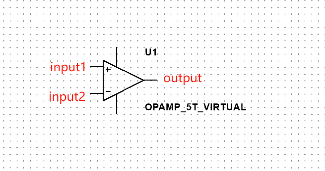
  - It also has two terminals for providing power to the device.
    - 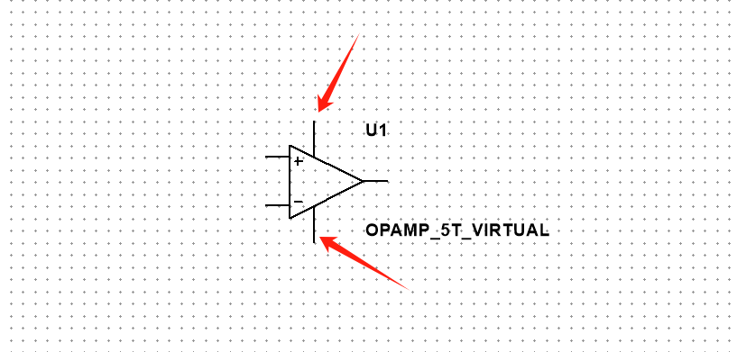
  - Current can never flow into or out of the input terminals. But the Current can flow into or out of the output terminals.
    - 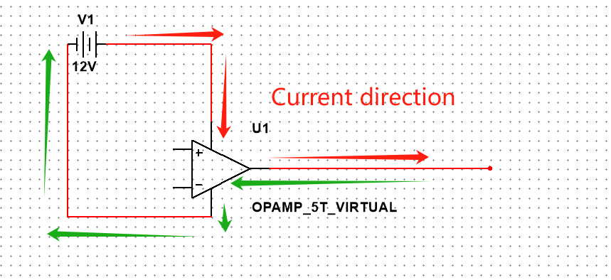
  
- The output voltages only are in between the voltages of the two power terminals. As the figure show above, the range of output voltages are from -12V to 12V. 
  - The op amp takes the voltage value of the "+" input and subtracts from it the voltage value of the "-" input.
    
    - 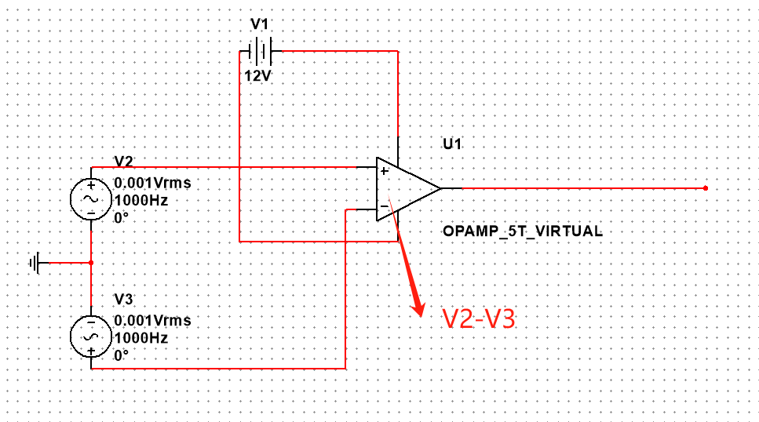
    
  - The op amp will take this difference between the two input voltages and multiple it by a very large number (Open loop magnification).
  
  - Using the Oscilloscope connect with the output of the op amp (B) and the "+" of the input (A) as follows:
    
    - 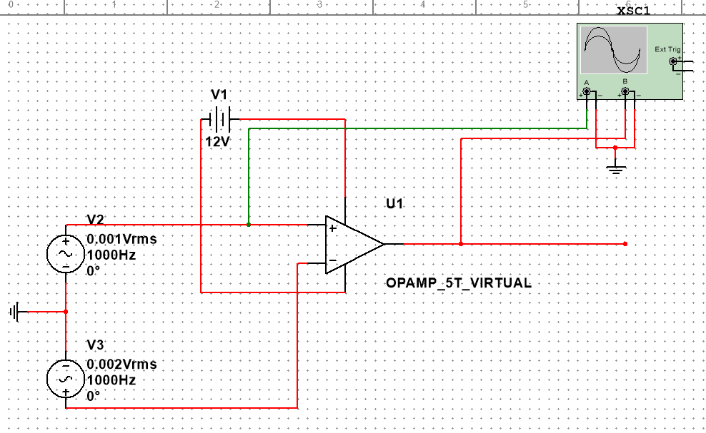
    
  - We can see when the "+" input is slightly lower than the "+" input, the op amp will try to make the output voltage equal to the largest negative number it is capable of producing. 
  
  - In this picture, the Channel_B is connect with the output, and the Channel_A is connect with the "+" input, we can see the output voltage is a very large negative voltage around -954kV while the channel_A is just 1.216 mV, which is just since the V2 is 0.001Vms and V3 is 0.002Vms.
    
    - 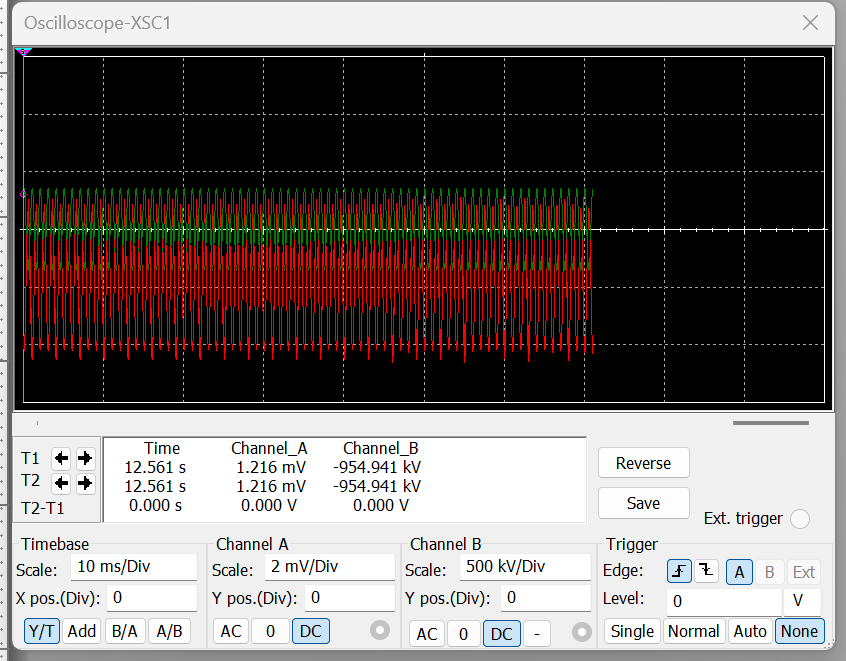
    
  - As the figure shown below, when the "+" side of the input add the resistance R1 and the R2 with negative feedback circuit, if the voltage of V2 is less than V3, then part of the voltage amplified from output will come back to the "+" side input. In conclusion, both "+" and "-" side voltage will become the same level finally since the negative feedback circuit.
    
    - 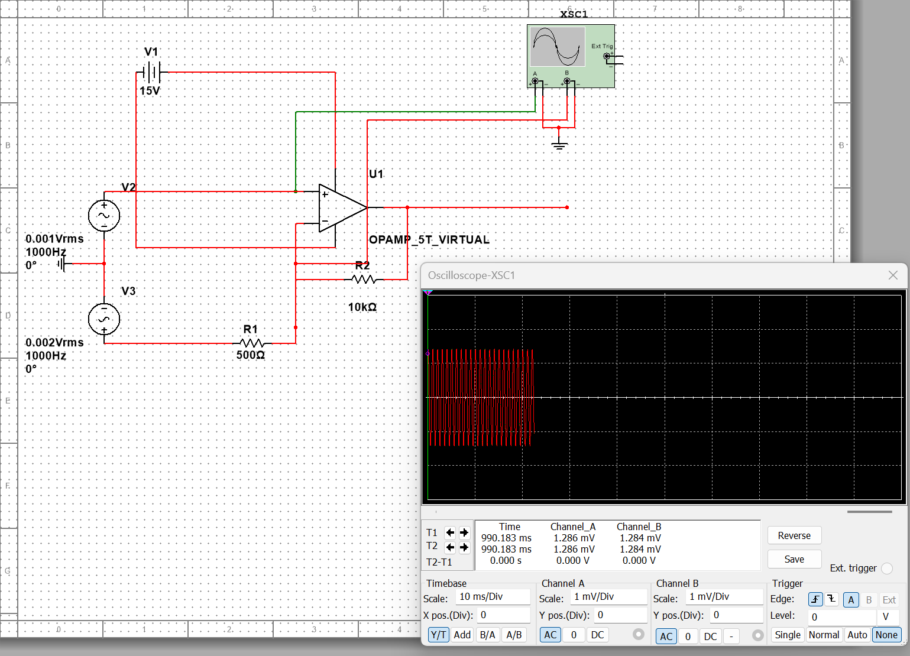
    
  - On the contrary, when the voltage of the V2 is larger than the V3, the voltage of the A and B still the same finally ( As shown in below figure). Because the negative feedback always forces the op amp's two terminals to  always be at almost the same voltage value.
    
    - 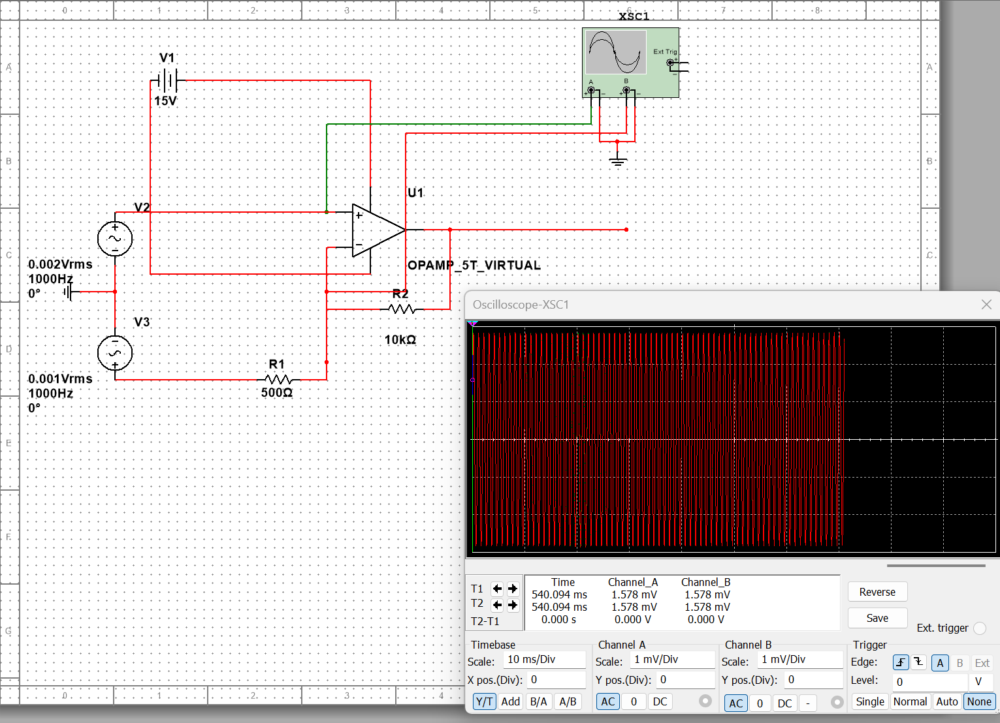
    
  - From above analyse, we can see when the voltage of non-inverting input larger than the  inverting input, the output voltage will increase (As figure shown below). The Current will flow from output to inverting input while it cannot flow into the op amp.
  
    - 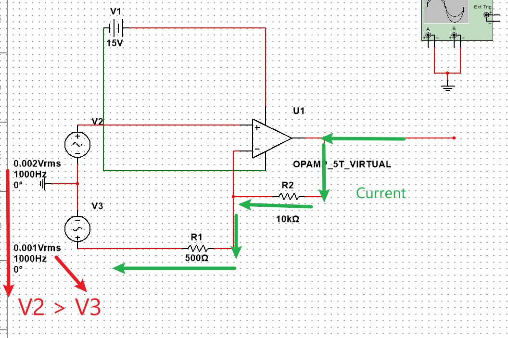
    
  - Since the current of inverting input is the same as the current of output. Thus we can get the current through:
  
    - $$
      Current = \frac{V_{input}}{R_1}
      $$
  
  - Consequently, we can calculate the V_output through below formula:
  
    - $$
      V_{output} = Current \times (R_1+R_2)
      $$
  
      
  
  - Finally we get the formula related to V_output and R1,R2 and V_input:
  
    - $$
      V_{output}=(1+\frac{R_2}{R_1}) \times V_{input}
      $$
  
- #### Op amp as adder

  - We use V3, V4 and V5 to simulate the the circuit in parallel connects to inverting input, and the resistance of R1,R2,R3 and R4 are the same. 
  - 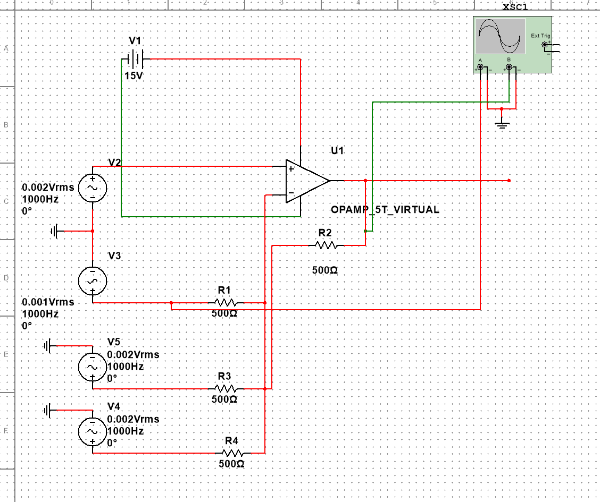

  - Using the Oscilloscope to check the current of R1 and R2. We can observe that the value of A and B are around 3 times related. Thus we can infer the relation as follows:

    - $$
       V_{output} = -[V_{input1}+V_{input2}+V_{input3}]
      $$

      

    - 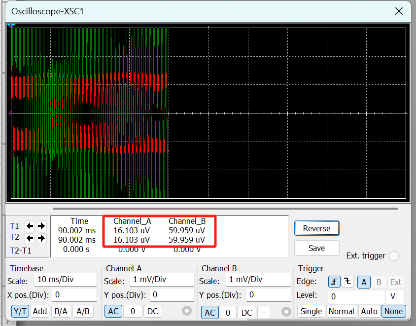

- Plan for Next Week
  - Numerical insights into EMG’s Instrumentation Amplifier
  - Understand the principles of high-pass filters
  - Numerical insights into EMG’s High Pass Filter
  - Understand the principles of full-wave rectifiers
  - Numerical insights into EMG’s full-wave rectifiers