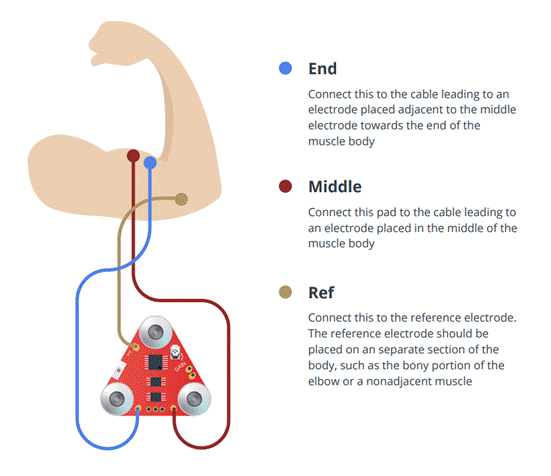
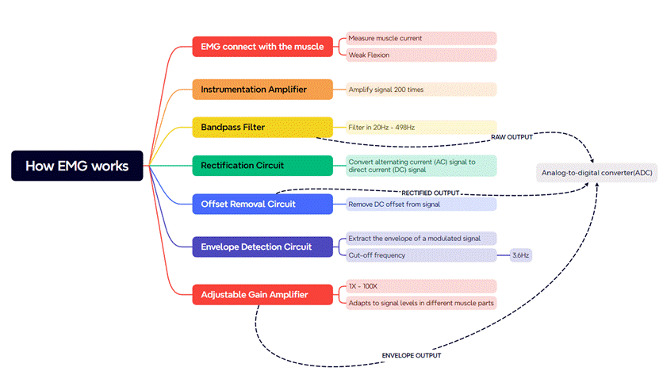
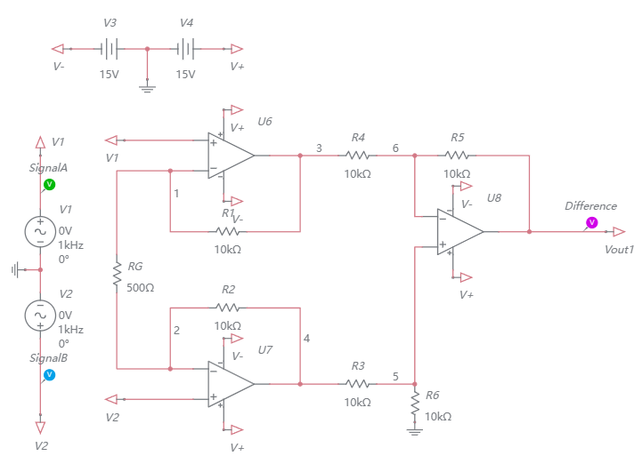
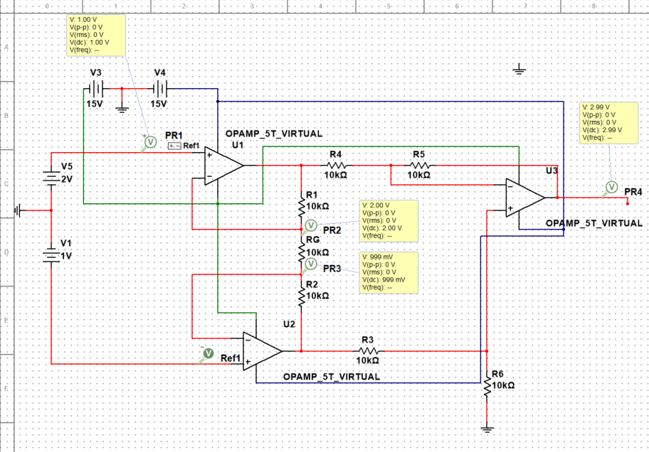

### Week 20 Summary

To achieve the function of the EMG system module, the most important thing is know how to extract the surface electromyogram signal of the muscle group and identify the signal. When using the Compound carbon aerogel electrode (2 test electrodes, 1 reference electrode) get the SEMG from the muscle group, the test electrodes will transmit the signal to amplifier. The differential amplifier is used to reduce the common noise signal of two electrodes and amplify the difference of these two signals. 

The signal after these steps will become the Raw EMG Output, which can be processed by MATLAB , also can be processed through High-Pass Filter, Full-Wave Rectifier, diffience Amplifier and Integration Amplifier and get the Envelope EMG Output.

 

When raw signals are processed with MATLAB,We need to transplant the following functions implemented on hardware to matlab:

(1)  Put the amplified signal into High-Pass Filter to eliminate the Low frequency signal and potential DC offset to block signals of muscle activity. 

(2)  Use Lead-and-lag rectifier (Precision rectifier) to output the absolute value of the EMG signal.

(3)  Use differencial amplifier to amplify the difference between the reference electrode and Emg signal after full wave rectifier. 

(4)  Use the Integration Amplifier to get the Envelope EMG Output. 

In conclusion, after the EMG signal is measured, the reference signal and the signal at two points of the test electrode are used to amplify and make a difference, rectification, removal of the offset and finally integrated into an EMG envelope signal.

- ### Analize of the Instrumentation Amplifier

- A meter amplifier usually consists of three operational amplifiers, including two buffer amplifiers. The buffer amplifiers utilize the high input impedance and low output impedance of the amplifiers to isolate and protect the signal, and they are often used to enhance the strength of the signal.

- In my opinion, because the myoelectric signal is too weak, usually in the microvolt level, directly measuring the error of the myoelectric signal with a differential amplifier would result in a significant error. Therefore, amplifying the signal before differential amplification helps reduce the error.

- In the circuit, except for RG, the resistances of the other resistors are the same, for the convenience of calculating the amplification gain. The convenience of this circuit lies in the fact that only adjusting the resistance value of RG can change the amplification gain.

- Due to the high input impedance and low output impedance (close to 0) of the amplifier, the current passing through R1 will all flow to RG instead of back to the amplifier. Hence, we can accurately control the gain by changing RG.

- The non-inverting input of the U3 operational amplifier at the back needs to be grounded using an R6 because we need to make the input and output terminals symmetrical, meaning each input terminal should pass through the same resistor to ground.

- 

- Formula derivation for the meter amplifier:

  - Due to negative feedback, the voltage at the inverting input will be pulled to be the same as the non-inverting input. At this point, the voltage at both ends of RG will be the same as the input terminal voltage, so we have:

    - $$
      I_{Rgain} = \frac{(V_2 - V_1)}{R_{gain}}
      $$

  - Next, we calculate the voltage difference at the output of the two buffer amplifiers:

    - $$
      V_{out2} - V_{out1} = I_{gain} \times (R_1+R_2+R_{gain}) = (V_2 - V_1)\times (\frac{2R_1}{R_{gain}}+1)
      $$

  - For the U3 operational amplifier, we can use Kirchhoff's law on its two input terminals (assuming the operational amplifier is ideal, equal voltages at the input terminals due to the feedback circuit, assuming Vx):

    - $$
      For "-" input: I_{R4} + I_{R5} = \frac{V_x - V_4}{R_4} + \frac{V_x - V_{out}}{R5}=0   ......①
      $$

    - $$
      For "+" input: I_{R3} + I_{R6} = \frac{V_x - V_3}{R_3} + \frac{V_x - V_{out}}{R6}=0. . . . . .②
      $$

  - Since R3 = R6, R4 = R5, eliminating Vx from equations ① and ②:

    - $$
      \frac{V_x - V_4}{R_4} + \frac{V_x - V_{out}}{R5} -\frac{V_x - V_3}{R_3} - \frac{V_x - V_{out}}{R6}
      = 0
      $$

    - Simplifying:

      $$
      V_3 - V_4 = \frac{R_3}{R_4}V_{out}
      $$

    - As Vout1 = V4, Vout2 = V3, then:

    - $$
      V_{out2} - V_{out1} = (V_2 - V_1)\times (\frac{2R_1}{R_{gain}}+1) =\frac{R_3}{R_4}V_{out}
      $$

    - $$
      V_{out} =(V_2 - V_1)\frac{R_4}{R_3} (\frac{2R_1}{R_{gain}}+1)
      $$

  - Where V2 - V1 is the voltage difference between the two input terminals, and R4 equals R3 in general, the gain depends on 2R1/Rgain.

- As shown in the above image, when all resistors are 10kΩ and the input voltage difference is 1V, the amplification factor should be three times. It can be observed that the output voltage is indeed amplified by around three times, to 3V.

- #### Plan for next week

  - Preparing to test the actual EMG sensor (Myoware 2.0) 
  - Try to connect the original EMG signal to the computer and process it using MATLAB

