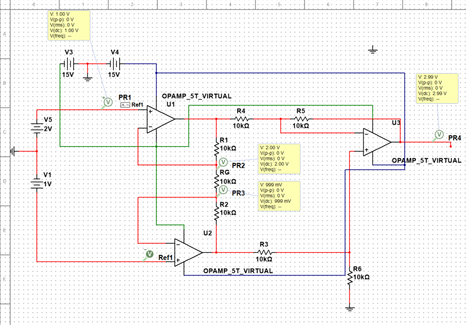

### Week 20 Summarize

- 仪表放大器通常由三个运算放大器组成，其中有两个缓冲放大器，缓冲放大器是利用了放大器的高输入阻抗和低输出阻抗去隔绝信号与保护信号，并且缓冲放大器也经常被用来增强信号的强度。

- 在我看来，因为肌电信号太弱了，通常是微伏级别，所以直接用差分放大器去测量肌电信号的误差会非常大，所以先对信号进行放大后在进行差分放大有助于减少误差。

- 电路中除了RG其余电阻阻值一样，是为了方便计算放大增益，该电路方便之处在于只需要调整RG阻值即可改变放大增益。

- 因为放大器的高输入阻抗和低输出阻抗（接近于0）导致经过R1的电流会全部流向RG而不是流回放大器，所以我们可以通过改变RG来精确控制增益。

- 在后面那个U3运算放大器的非反相输入端要使用一个R6接地，是因为我们需要使输入输出端对称，也就是将每个输入端都应该通过相同的电阻到地。

- 

- 仪表放大器公式推导：

  - 由于负反馈作用，反相输入端的电压会被拉至与非反相输入端相同，这时RG两端的电压就会与输入端电压相同，那么我们就有：

    - $$
      I_{Rgain} =  \frac{(V_2 - V_1)}{R_{gain}}
      $$

  - 接着我们计算两个缓冲放大器的输出端电压差值：

    - $$
      V_{out2} - V_{out1} = I_{gain} \times (R_1+R_2+R_{gain}) = (V_2 - V_1)\times (\frac{2R_1}{R_{gain}}+1)
      $$

  - 对于U3的运算放大器，我们它的对两个输入端使用基尔霍夫定律可以得到（由于假设运算放大器是理想的，由于反馈电路导致两个输入端电压也是相等的，假设为Vx）：

    - $$
      For "-" input: I_{R4} + I_{R5} = \frac{V_x - V_4}{R_4} + \frac{V_x - V_{out}}{R5}=0   ......①
      $$

    - $$
      For "+" input: I_{R3} + I_{R6} = \frac{V_x - V_3}{R_3} + \frac{V_x - V_{out}}{R6}=0. . . . . .②
      $$

      

  - 因为R3 = R6 , R4 = R5 ， 所以把① - ② 消去 Vx得到：

    - $$
      \frac{V_x - V_4}{R_4} + \frac{V_x - V_{out}}{R5} -\frac{V_x - V_3}{R_3} - \frac{V_x - V_{out}}{R6}
      = 0
      $$

    - ​	化简得到：
      $$
      V_3 - V_4 = \frac{R_3}{R_4}V_{out}
      $$

    - 此时因为Vout1 = V4, Vout2 = V3 所以：

    - $$
      V_{out2} - V_{out1} = (V_2 - V_1)\times (\frac{2R_1}{R_{gain}}+1) =\frac{R_3}{R_4}V_{out}
      $$

    - $$
      V_{out} =(V_2 - V_1)\frac{R_4}{R_3} (\frac{2R_1}{R_{gain}}+1)
      $$

  - 其中V2 - V1 是两个输入端电压的差值，R4与R3一般相等 ， 增益取决于2R1/ Rgain

- 如上述图中，当所有电阻都为10kΩ，输入电压差值为1V时，放大倍数应该是三倍，可以看到输出端电压确实是放大了三倍左右，为3V。