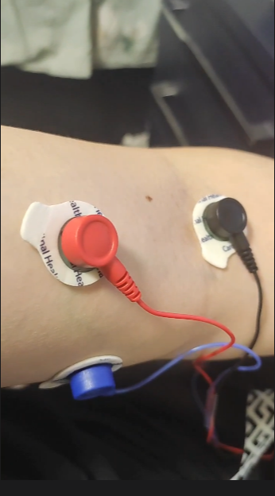
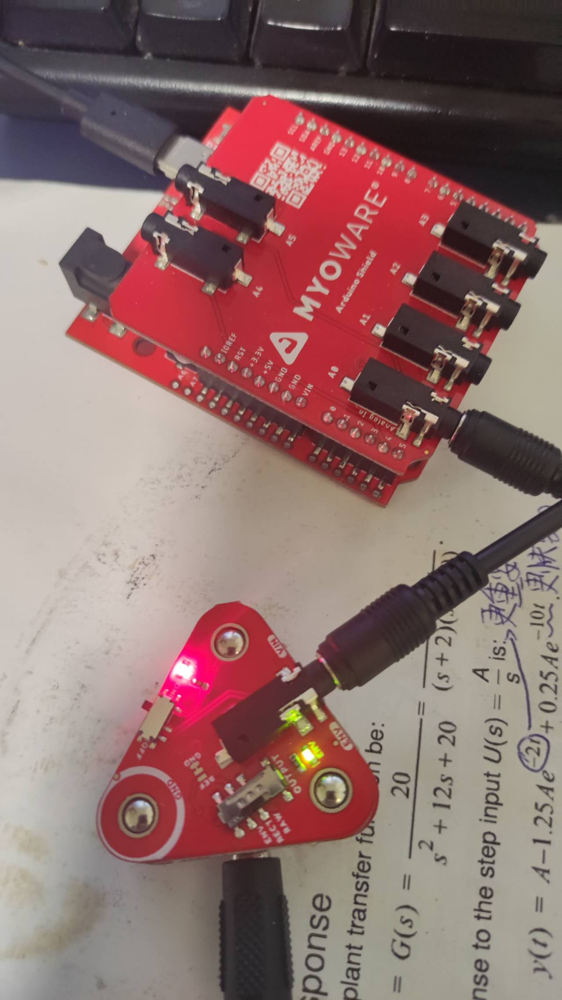
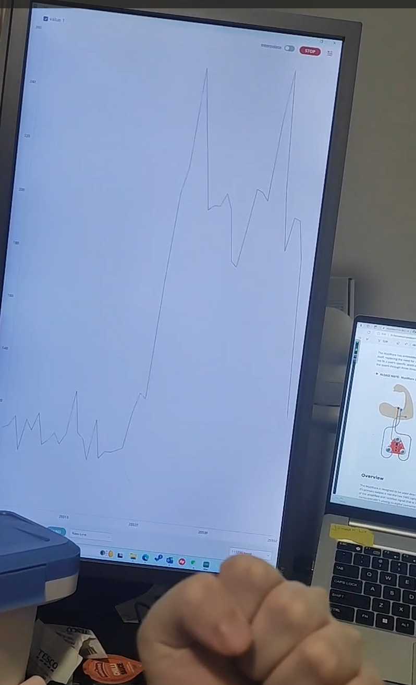

## The 21th Week Summarize

- This week, successfully connect the EMG sensor with my arm and test the signal of the Envelop Output successfully.

- The test code as follows:

  - ```c
    void setup() 
    {
      Serial.begin(115200); //Set baud rate
      while (!Serial); // optionally wait for serial terminal to open
      Serial.println("MyoWare Example_01_analogRead_SINGLE");
    }
    
    void loop() 
    {  
      int sensorValue = analogRead(A0); // read the input on analog pin A0
    
      Serial.println(sensorValue); // print out the value you read
    
      delay(50); // to avoid overloading the serial terminal
    }
    ```

    

- We first connect the Sensor Cable to the arm. The red line is one of the test electrode, and it placed in the middle of the  muscle body. The black line also is one of the test electrode, it placed adjacent to the middle  electrode towards the end of the  muscle body. The blue line is the reference electrode, it placed  on bony portion of the  elbow or a nonadjacent muscle.



- Then We connect the Arduino development board to the computer and the EMG sensor. Flip the power switch to the OFF position on the Link Shield, adjust the OUTPUT switch to Envelope Output position and then turn the power switch to the ON position. Reopen the Serial Plotter and we will see a smaller signal output when flexing your forearm.
  - 

- When muscles relax naturally, the Envelope Output fluctuates between 95 and 135.


- When we contract our arm muscles, we can see that the signal rises to around 200.

