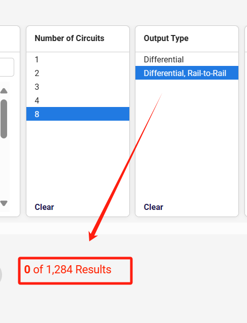
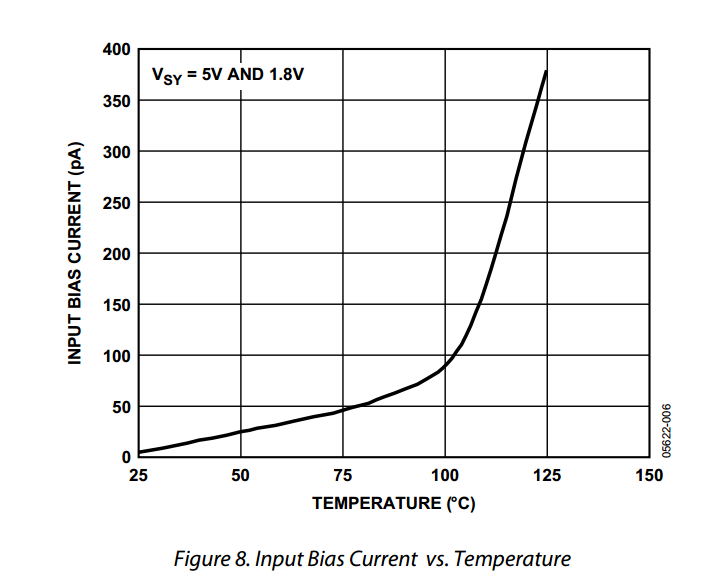

## The 22th Week Summarize

#### Differential amplifier selection : AD8619

- Due to the various requirements for EMG electromyographic signals, AD8619 was still chosen as the differential amplifier after comparison, for the following reasons:

  - **8通道放大器缺乏**：当前市面上并没有太多的8通道rail to rail放大器，所以只能选择4通道rail to rail 放大器。

    - 

  - **成熟产品的选择**：MyoWare2.0的差分放大器也是AD8619的，所以选择这个放大器肯定不会有太大差错。

    - 

  - **供电电压**：放大器工作电压在1.8V - 5V ，如应用手册所示。

    > - The parts are fully specified to operate from 1.8 V to 5 V single supply, or ±0.9 V and ±2.5 V dual supply. The combination of low noise, very low input bias currents, and low power consumption make the AD8613/AD8617/AD8619 especially useful in portable and loop-powered instrumentation

  - **增益带宽积**：确保所选放大器满足应用的频率响应需求。

  - **输入和输出特性**：输入偏置电流极低，如下图所示。

    - 

  - **温度范围**：25°C左右的环境下可以正常工作，误差较小。

    - 

- 如果需要测量8个或以上的肌肉群，那么我们可以多加一个AD8619放大器来测量肌电信号。

- 在了解了差分放大器之后，我在查资料过程中对工频信号有了一个初步的了解，工频信号在英国是60Hz，然而正常人体表面肌电信号赋值为0~1.5mV，主要能量频段集中在10~150Hz。它就会包含工频信号的干扰。此时差分放大器可以通过同时放大两个输入端之间的电压差来同时抑制两个输入端共同的信号（共模信号）。使用差分放大器可以在一定程度上减少这种类型的干扰，但是否能够完全消除这些误差取决于电路的设计是否科学，所以我们要开始学习设计电路。

- 首先需要开始学习设计最小MCU电路，由于之前没有对这一领域有涉猎，所以先对一个最经典的最小MCU电路进行学习：
  - 