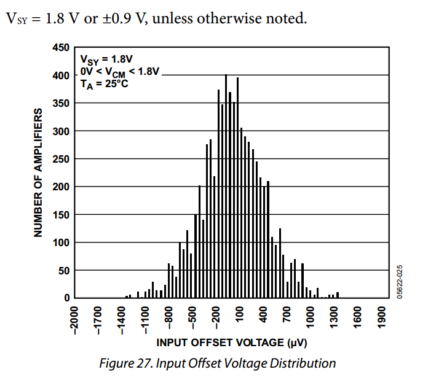
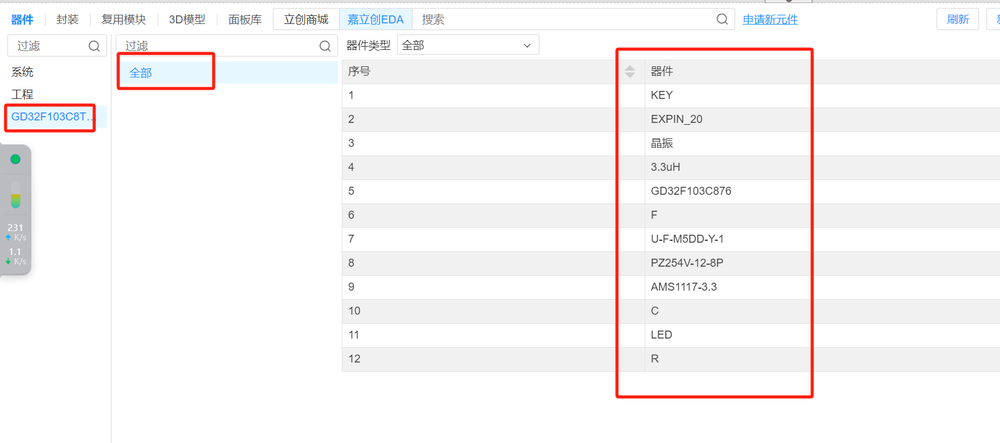

## 22nd Week Summary

#### Differential amplifier selection : AD8619

- Due to the various requirements for EMG electromyographic signals, AD8619 was still chosen as the differential amplifier after comparison, for the following reasons:

  - **Insufficient 8-channel amplifiers**: There aren't many 8-channel rail to rail amplifiers on the market currently, so we had to opt for a 4-channel rail to rail amplifier.

    - 

  - **Choice of mature product**: MyoWare2.0 also uses AD8619 as its differential amplifier, so choosing this amplifier is unlikely to go wrong.

    - 

  - **Supply voltage**: The amplifier works at voltages between 1.8V - 5V, as shown in the application manual.

    > - The parts are fully specified to operate from 1.8 V to 5 V single supply, or ±0.9 V and ±2.5 V dual supply. The combination of low noise, very low input bias currents, and low power consumption make the AD8613/AD8617/AD8619 especially useful in portable and loop-powered instrumentation

  - **Gain-bandwidth product**: Ensure that the chosen amplifier meets the frequency response requirements of the application.

  - **Input and output features**: Extremely low input bias current, as shown below.

    - 

  - **Temperature range**: It can function normally in a room temperature environment around 25°C, with minimal errors.

    - 

- If we need to measure eight or more muscle groups, then we can use an additional AD8619 amplifier to measure electromyogram signals.

- After understanding the differential amplifier, I initially understand power frequency signals during the literature review process. Power frequency signals in the UK are 60Hz. However, normal surface electromyogram signals range from 0~1.5mV, and the main energy frequency range is concentrated at 10~150Hz. Hence, they may include power frequency signal interference. At this point, the differential amplifier can suppress the common signals of both the input ports by simultaneously amplifying the voltage difference between them. Using differential amplifiers can reduce this type of interference to some extent, but whether these errors can be completely eliminated depends on the science of the circuit design, so we need to start learning to design circuits.

- First, we need to start learning to design the smallest MCU circuit. Since I did not have prior exposure to this area, I started by learning the most classic minimum MCU circuit:

  - Notes from studying the PCB circuit diagram are shown below:
    - 
  - Based on the existing circuit diagram, I replicated the exact diagram in EDA software to improve my proficiency in using EDA software, and created my component library through this. As shown below:
    - This is the circuit diagram I replicated: 
    - This is my self-created component library: 
    - EDA software interface: 
  - The circuit diagram I designed passed the DRC check, other than no packages being added to the components, everything was normal.
    - 
  
- Plan for next week:

  - Improve my component library by adding packages to components
  - Design a circuit diagram that integrates the amplifier and MCU minimal system, featuring ADC functionality, MCU+WiFi module+AD8619.

