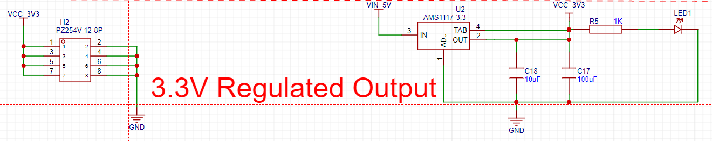
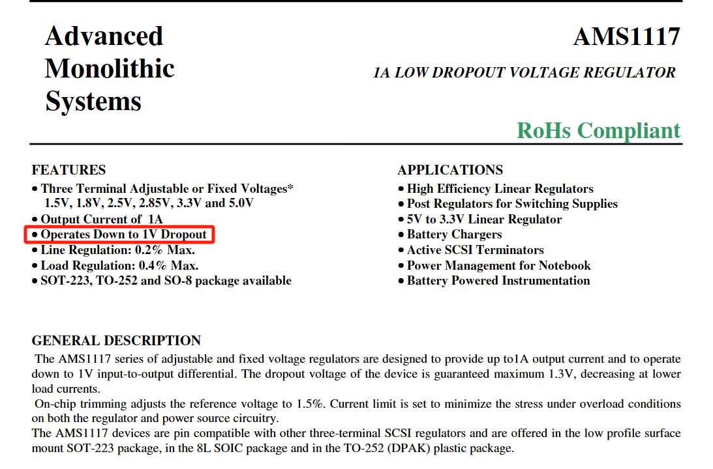

## The 23th Week Summarize

- This week's goal is to study the circuit design structure and design a circuit suitable for installing a differential amplifier.
- First we analyse the MCU chip which I used to design the circuit:
  - 

<b>Figure 1 MCU Minimum System Circuit</b>

- 根据网络上的芯片产品信息，[GD32F103C8T6-Arm Cortex-M3-兆易创新半导体有限公司 --- GD32F103C8T6-Arm Cortex-M3-GigaDevice Semiconductor Inc.](https://www.gigadevice.com/product/mcu/arm-cortex-m3/gd32f103c8t6)该芯片属于GD32F1系列芯片，其具有以下特点：
  - 基于ARM® Cortex®-M3内核，这种核心专门针对低功耗、实时性和成本效益进行了优化，适用于各种应用，包括汽车、工业控制、消费类电子和医疗设备等。
  - 32位系统，支持最高运行频率为108MHz，提供高达3024KB的片上Flash存储器和高达96KB的SRAM。多种增强型 I/O 端口和片上外设连接到两条 APB 总线。
  - 提供多达 3 个 12 位 1MSPS ADC 和 10 个通用 16 位定时器以及 1 个 PWM 高级定时器，以及标准和高级通信接口。
- 如下图所示，根据datasheet里面的图片我们可以确定该芯片是GD32F103的C系列芯片。
  - 

<b>Figure 2 GD32F103Cx LQFP48 pinouts</b>

- 然后，我们通过分析芯片的Block Diagram可以知道它有三个12位的ADC接口，并且还是每秒百万样本的ADC。因为我们的需求是至少安装两个4通道差分放大器用于测量肌电信号，所以利用每个ADC具有多个通道，我们到时候可以使用多路选择器（MUX）来切换输入信号源，以实现对多个信号的采样。
  - 

<b>Figure 3 GD32F103Cx Block Diagram</b>

- 根据Figure 4的针脚定义可以看到，我们有总共9个ADC针脚可以使用，所以最多可以同时处理9个差分放大器传输的肌电信号，那么就可以接2个4通道的差分放大器，满足我们的设计要求。
  - 

<b>Figure 4 GD32F103Cx Pin Definitions</b>

- 在分析差分放大器如何接入电路之前，我们需要对整个MCU系统进行分析：
  - 3.3V稳压输出电路分析
    - 稳压器采用了AMS1117-3.3 这个稳压器选取对于我们的肌电信号能否成功读取有很大关系，因为如果稳压器输出电压值精度不高的话很难侦测到肌电信号，所以我们需要使用电压精度高，电源噪声抑制能力强的稳压芯片。
    - 

<b>Figure 5 3.3V Regulated Output Circuit</b>

- 通过查阅AMS1117-3.3datasheet得知（如Figure 6），其最低工作电压差在1V，然而我们的肌电信号通常是在毫伏至微伏变化，即使使用了差分放大器放大200倍也达不到压差1V，所以稳压器的误差产生的电压远比我们要测量的信号大。

  - 

    
<b>Figure 6 Datasheet of the AMS1117-3.3</b>

  - 我们考虑更换一个稳压芯片,至少要达到如下要求：

    - ①工作压差至少要mv级别 
    - ②噪声水平要尽可能低，在uV级别最好 
    - ③ 输出电流要在几毫安到几十毫安之间以满足EMG传感器的负载要求。

  - 

    - 

  - - 