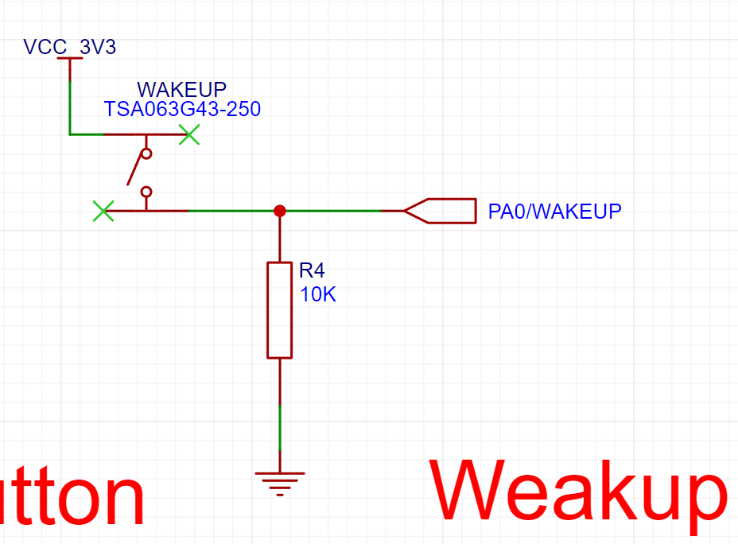

## Summary of the 23rd Week

- The goal for this week is to analyze the circuit design structure and create a circuit suitable for integrating a differential amplifier.
- Initially, we examined the MCU chip that was utilized in the circuit design:
  - 
  

<b>Figure 1 MCU Minimum System Circuit</b>

- According to the chip specifications found online, [GD32F103C8T6-Arm Cortex-M3-GigaDevice Semiconductor Inc.](https://www.gigadevice.com/product/mcu/arm-cortex-m3/gd32f103c8t6), this chip belongs to the GD32F1 series and has the following features:
  - Based on the ARM® Cortex®-M3 core, this core is optimized for low power consumption, real-time performance, and cost-effectiveness, suitable for various applications including automotive, industrial control, consumer electronics, and medical devices.
  
  - It is a 32-bit system, supporting a maximum operating frequency of 108MHz, offering up to 3024KB of on-chip Flash memory and up to 96KB of SRAM. Various enhanced I/O ports and on-chip peripherals are connected to two APB buses.
  
  - It provides up to 3 12-bit 1MSPS ADCs, 10 general 16-bit timers, and one PWM advanced timer, along with standard and advanced communication interfaces.
  
    > - The GD32F103xx device incorporates the Arm® Cortex®-M3 32-bit processor core operating
    >   at 108 MHz frequency with Flash accesses zero wait states to obtain maximum efficiency. It
    >   provides up to 3 MB on-chip Flash memory and up to 96 KB SRAM memory. An extensive
    >   range of enhanced I/Os and peripherals connected to two APB buses. The devices offer up
    >   to three 12-bit ADCs, up to two 12-bit DACs, up to ten general 16-bit timers, two basic timers
    >   plus two PWM advanced timer, as well as standard and advanced communication interfaces:
    >   up to three SPIs, two I2Cs, three USARTs, two UARTs, two I2Ss, an USBD, a CAN and a
    >   SDIO.
- As shown in the following image, based on the pinout diagram in the datasheet, we can confirm that this chip belongs to the GD32F103 C-series.
  
  - 

<b>Figure 2 GD32F103Cx LQFP48 pinouts</b>

- Next, by analyzing the Block Diagram of the chip, we can identify that it features three 12-bit ADC interfaces, each capable of sampling one million times per second. As we require at least two 4-channel differential amplifiers for measuring electromyography signals, we can use multiplexers (MUX) with multiple channels per ADC to switch input signal sources and sample multiple signals simultaneously.
  - 

<b>Figure 3 GD32F103Cx Block Diagram</b>

- Referring to the pin definitions in Figure 4, we can see that there are a total of 9 ADC pins available for use. Therefore, we can simultaneously handle signals from up to 9 differential amplifiers, which allows for connecting 2 4-channel differential amplifiers to meet our design requirements.
  - 

<b>Figure 4 GD32F103Cx LQFP48 Pin Definitions</b>

- Prior to analyzing how the differential amplifiers will be integrated into the circuit, it is crucial to perform an analysis of the entire MCU system:
  - #### **3.3V Regulated Output Circuit Analysis:**

    - This circuit's primary function is to convert a 5V input voltage to a stable 3.3V output voltage.

    - AMS1117-3.3 datasheet link: [Microsoft Word - DS1117 (advanced-monolithic.com)](http://www.advanced-monolithic.com/pdf/ds1117.pdf)

    - The regulator used is the AMS1117-3.3. The choice of this regulator is crucial for successfully reading electromyography signals since low output voltage precision can hinder the detection of such signals. Therefore, we analyze this chip's suitability for our circuit based on voltage precision and power noise suppression capacity.

    - **Power Noise Suppression Capacity:** By referring to the specifications, the RMS Output Noise is only 0.003%, which translates to:

      - $$
        RMS \  Noise = 0.003 *0.01 *3.3V = 0.000099V = 99uV
        $$

      - As the EMG signal amplitudes are in the uV to mV range, filtering of the power noise is still necessary to achieve optimal results.

## 翻译 private_upload\default_user\2024-04-09-21-35-52\23thweek_summarize.md.part-1.md

- **Voltage Accuracy**: Referring to the table, the output voltage range of AMS1117 is within 3.201-3.399V, meaning there is a deviation of ±0.099V, which equates to a voltage variation of approximately 200mV.
  
  - Since the voltage accuracy is 200mV, it is necessary to reduce the range of voltage variation. To save costs, a small capacitance capacitor is chosen to reduce high-frequency noise and a large capacitance capacitor is used to stabilize the power supply voltage.

- Next, analyzing the circuit:

  

  - VIN_5V: 5V voltage input, supplying a 5V voltage to AMS1117-3.3.
  - AMS1117-3.3: Voltage regulator chip, outputting 3.3V voltage.
  - C18: Large capacitance capacitor, used for stabilizing the power supply voltage.
  - C17: Small capacitance capacitor, used for reducing high-frequency noise.
  - R5 and LED1: Acting as power indicator lights.
  - VCC_3V3: Output port, delivering 3.3V voltage.

- #### **USB Input Module Circuit Analysis**:

  - This module is primarily used to provide input voltage via the Micro input port.
  
  - Self-recovery fuse SMD1210P050TF: [Datasheet - LCSC Electronics](https://www.lcsc.com/datasheet/lcsc_datasheet_2208291400_PTTC-Polytronics-Tech-SMD1210P050TF-30_C466600.pdf)
  
  - U-F-M5DD-Y-1: [Datasheet - LCSC Electronics](https://www.lcsc.com/datasheet/lcsc_datasheet_1811151533_Korean-Hroparts-Elec-U-F-M5DD-Y-1_C91467.pdf)
  
  - Circuit Analysis:
  
    - U-F-M5DD-Y-1: Micro USB interface
    - SMD1210P050TF: Used to maintain current within 0.05A-2.0A, here serving as a 0.5A overcurrent protection.
    - D+ and D-: Differential signals used for data transmission to reduce common-mode interference.
    - C19, C13, C14: Used for filtering.
  
  

- #### **Crystal Oscillator Circuit Analysis**:

  - Left 8MHz crystal oscillator circuit:
  
    - C3 and C4: Matching capacitors that slightly affect the oscillation frequency and waveform.
    - X2: Generates an 8MHz electrical signal frequency.
    - R3: Used to eliminate harmonics and some filtering, placing the inverter in the linear operating region during the start of oscillations.
  
  - Right 32.768kHz crystal oscillator circuit:
  
    - C2 and C1: Startup capacitors.
    - X3: Generates a 32.768kHz electrical signal frequency.
    - The reason for not having a parallel resistor is that the microcontroller already integrates a high resistance resistor internally.
  
  

- #### **Reset Button and Wakeup Button Circuit Analysis**:

  - Reset button: When the microcontroller receives a low level (NRST pin), it will reset.
  
    - C20: Acts as a buffer to prevent voltage shocks to the microcontroller. When receiving a 3.3V voltage signal, the voltage does not immediately change but grows exponentially to 3.3V.
    - TSA063G43-250: A regular push button that, when pressed, sets the NRST input to a low level, triggering a reset.
  
  

  - Wakeup button: When the TSA063G43-250 button is pressed, PA0/WAKEUP outputs a high level, waking up the system.
  
  

- #### **MCU Main Control Circuit Analysis**:

  - Pin 1 and Pin 48 are connected to four capacitors: C10, C11, C8, and C9. VCC_3V3 provides 3.3V voltage, and the capacitors are used for filtering to reduce noise before supplying power to the MCU.
  - Pin 9: Implements LC filtering for VDDA using L1, C7, and C6 to provide analog power voltage.
  - Pins 23 and 24: VSS_1 is connected to GND to achieve grounding function, VDD_1 is connected to the 3.3V voltage through two-stage filtering to provide voltage. The same applies to Pins 36 and 35.
  - Pins 32 and 33: When you want to pull up these two pins, solder R14 and R15; when you want to implement IO port function, solder R12 and R10; when you want to implement serial port function, solder R13 and R11.
  - 

- The Plan of Next Week
  - Figure out how to connect the AD8619 amplifier with this circuit diagram
  - Complete the overall PCB design