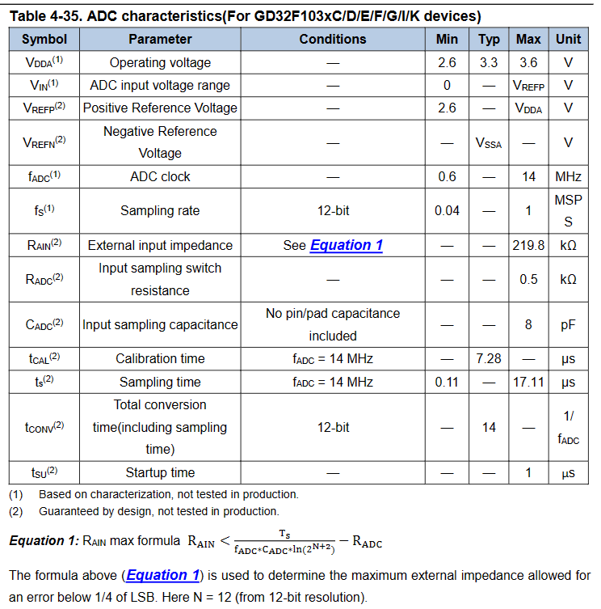
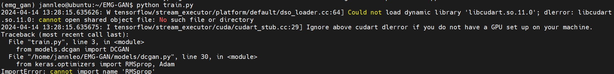

#### 24th Week Summary

- Work objectives for this week:
  - Since the entire circuit was designed last week, except for the amplifier section, this week we need to complete the design of the amplifier section and submit it to the PCB manufacturer to have the desired PCB board drawn as soon as possible.
  - Start preparing to generate analog signals for testing.

- After reviewing the paper on AD8619 ([Analog Devices: Healthcare ICs Solutions Bulletin, Volume 11, Issue 2 (psu.edu)](https://citeseerx.ist.psu.edu/document?repid=rep1&type=pdf&doi=67d00a7e2e6b532d7e95d5fb378d8db47219d2c3)), I found a very important point mentioned:

  > - The AD8619 quad micropower op amp is a cost-efficient option for EMG designs, particularly when combined with the AD8235 in-amp and AD7798 ADC. The AD8619 is fully specified to operate from 1.8 V to 5.0 V single supply and combines 22 nV/√Hz noise and 1 pA max input bias current, draws 38 μA of supply current, and is available in 14-lead TSSOP and 14-lead SOIC packages.

  - This indicates that in addition to using the instrumentation amplifier (AD8619), we also need a pre-amplifier because the amplification factor of the instrumentation amplifier is generally not high, while EMG signals are only at the uV level, so the AD8235 is needed as an operational amplifier.

- As for the need for AD7798 as an ADC, the GD32F103C8T6 chip used in the circuit already has ADC functionality, and the characteristics of the ADC built into this chip are shown in the following figure:

- 

- AD7798 data: [AD7798/AD7799 (Rev. B) (analog.com)](https://www.analog.com/media/en/technical-documentation/data-sheets/ad7798_7799.pdf)

- Based on the above data, the following table is derived:

  - | Comparison Item | GD32F103C8T6 | AD7798       | Summary     |
    | --------------- | ------------ | ------------ | ----------- |
    | Resolution      | 12-bit       | 16/24-bit    | Both meet   |
    | Sampling Rate   | 0.04MSPS     | 4.17-470Hz   | GD32 is better |
    | Input Range     | 0-3.6V       | 2.7V-5.25V   | Both meet   |
    | Noise and Distortion | Not mentioned | RMS noise 40nV |            |
    | Power Supply Voltage | Powered by 2.6-3.6V | 2.7-5.25V | Both meet |

  - Therefore, after comparison, we still choose to use the ADC built into GD32.

- AD8235 Instrumentation Amplifier [AD8235 (Rev. A) (analog.com)](https://www.analog.com/media/en/technical-documentation/data-sheets/AD8235.pdf)

  - After reviewing the datasheet, it was found that AD8235 is a very suitable instrumentation amplifier for amplifying EMG signals, as it is suitable for the medical instrument field.

    > - FEATURES
    >   	Low power
    >   		40 μA maximum supply current
    >   		6 nA shutdown current
    >   	Low input currents
    >   		50 pA input bias current
    >   		25 pA input offset current
    >   	High Common Mode Rejection Ratio (CMRR)
    >   		110 dB CMRR, G = 100
    >   	Space-saving
    >   		WLCSP package
    >   	Zero input crossover distortion
    >   	Versatile
    >   		Rail-to-rail input and output
    >   		Shutdown
    >   		Gain set with a single resistor (G = 5 to 200)
    >   	AD8236: μSOIC package version of AD8235
    >   APPLICATIONS
    >   	Medical instrumentation
    >   	Low-side current sense
    >   	Portable electronics

- Based on this information, we designed the connection diagram of AD8235 in the EDA software:

  - A1: Connect to the positive terminal power interface, which is the 3.3V regulated power VCC_3V3.
  - A2: As the shutdown pin, connecting to +V enables normal operation, connecting to -V shuts down.
  - A3 and D3: Serve as the receiving end of the EMG signal A and signal B input interfaces. Since AD8235 is dual-channel, theoretically, for monitoring how many muscle signals, we need an equivalent number of AD8235s. Therefore, these two ports correspond to INPUT_A1, INPUT_A2 up to INPUT_D1, INPUT_D2.
  - B1: Connect as the Vout interface to the input terminal of the subsequent AD8619.
  - B2, D2, C3, B3: Temporary settings not configured.
  
  - Step D1: Connect the negative pole of the power supply.
  
  - Step C1: Connect the input of the reference voltage terminal.
  
- 

    
<b>Figure 2 Connection diagram of AD8235</b>

- The connection diagram of AD8619 is as follows:
  - PA1-PA4: Connect the ADC-related interfaces of GD32F103C8T6 respectively.

  - Vout1 - Vout4: Connect the Vout pin of different EMG signals of AD8235 as input voltage.

  - Vref1 - Vref4: Connect the REF pin of different EMG signals of AD8235 as reference voltage.

- VDD: Connect to the 3.3V regulated power supply interface.

  - VSS: Connect to the negative pole of the 3.3V regulated power supply.

  - 

    
<b>Figure 3 Connection diagram of AD8619</b>

- After completing the PCB design, we then proceed to simulate the EMG signal.
  - After searching online, I found that the EMG-GAN project can be used to simulate and generate EMG signals. [larocs/EMG-GAN: GANs for generating EMG signals (github.com)](https://github.com/larocs/EMG-GAN)
  - However, since my computer does not have a GPU, it cannot run the project effectively. If the teacher can provide a school's Linux virtual machine with GPU, I can quickly train many experimental data. But it seems not very necessary, haha.
    
    - 
    
      
<b>Figure 4 Error message from EMG-GAN project</b>

  - I later tried alternative two: using the dataset [Ninapro - DB5 (hevs.ch)](https://ninapro.hevs.ch/instructions/DB5.html)
    - This dataset, as an open dataset, includes surface electromyography and kinematic data of 10 full subjects repeating 52 hand movements and rest positions.
    - I downloaded some of this dataset and found that it is in the form of .mat files. By converting it into .csv files using Matlab, theoretically, it can be imported into Multisim as a signal source for simulation testing.

- So far, I have completed the initial PCB design and obtained test data. Next, I plan to simulate the circuit in Multisim and use the test data for testing. If successful, we will proceed to design and connect the WiFi module, and finally produce the target PCB through a PCB manufacturer for physical testing. This is my current plan.

