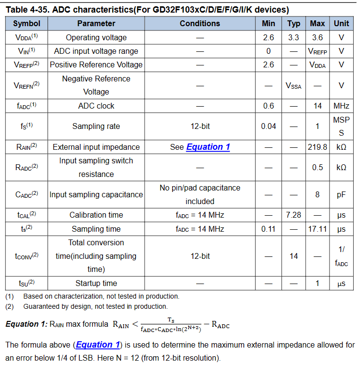
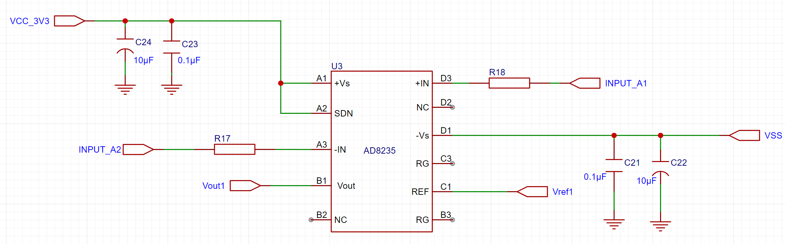
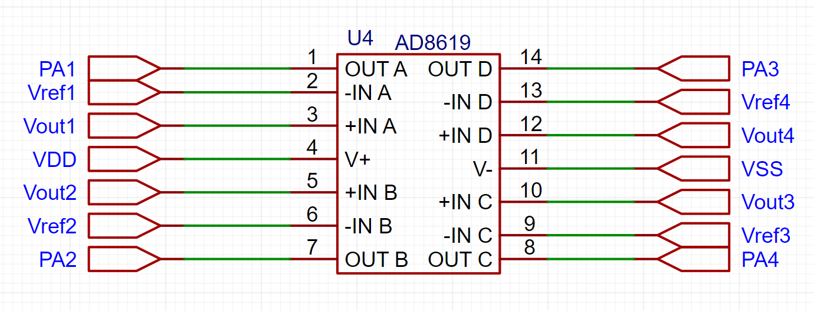
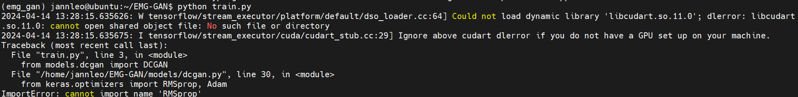

#### 24th Week Summarize

- 本周工作目标：

  - 由于上个星期对整个电路进行了设计，还差一个放大器部分，所以这周要完成放大器部分的设计并且提交到PCB厂商尽早画出想要的PCB板。
  - 开始准备生成模拟信号用于测试

- 在查询了有关AD8619的论文后（[Analog Devices : Healthcare ICs Solutions Bulletin, Volume 11, Issue 2 (psu.edu)](https://citeseerx.ist.psu.edu/document?repid=rep1&type=pdf&doi=67d00a7e2e6b532d7e95d5fb378d8db47219d2c3)）我发现它有提到一点十分重要：

  > - The AD8619 quad micropower op amp is a cost efficient option for EMG designs particularly when combined with the AD8235 in-amp and AD7798 ADC. The AD8619 is fully specified to operate from 1.8 V to 5.0 V single supply and combines 22 nV/√Hz noise and 1 pA max input bias current, draws 38 μA of supply current, and is available in 14-lead TSSOP and 14-lead SOIC packages

  - 以上说明了除了使用仪表放大器（AD8619），我们还需要前置放大器，因为仪表放大器的放大倍数普遍不高，而诸如EMG信号却仅仅只有uV级别，所以需要AD8235作为运算放大器。

- 至于是否需要AD7798作为ADC，电路中使用的GD32F103C8T6芯片已经自带了ADC功能，该芯片自带的ADC特性如下图所示：

- 

  
<b>Figure 1 GD32F103C8T6芯片自带的ADC特性</b>

- AD7798数据：[AD7798/AD7799 (Rev. B) (analog.com)](https://www.analog.com/media/en/technical-documentation/data-sheets/ad7798_7799.pdf)

- 根据以上数据，得到如下表格：

  - | 比较项     | GD32F103C8T6 | AD7798         | 总结       |
    | ---------- | ------------ | -------------- | ---------- |
    | 分辨率     | 12bit        | 16/24 bit      | 均符合条件 |
    | 采样速率   | 0.04MSPS     | 4.17-470Hz     | GD32更优   |
    | 输入范围   | 0-3.6V       | 2.7V-5.25V     | 均符合条件 |
    | 噪声和失真 | 未提及       | 均方根噪声40nV |            |
    | 电源电压   | 2.6-3.6V供电 | 2.7-5.25V      | 均符合条件 |

    

  - 因此在比较之后，我们还是选择采用GD32自带的ADC。

- AD8235仪表放大器[AD8235 (Rev. A) (analog.com)](https://www.analog.com/media/en/technical-documentation/data-sheets/AD8235.pdf)

  - 查看了datasheet之后发现，AD8235是一个非常适合放大EMG信号的仪表放大器，因为他适用于医疗仪器领域。

    > - FEATURES
    >   	Low power
    >   		40 μA maximum supply current
    >   		6 nA shutdown current
    >   	Low input currents
    >   		50 pA input bias current
    >   		25 pA input offset current
    >   	High Common Mode Rejection Ratio (CMRR)
    >   		110 dB CMRR , G = 100
    >   	Space saving
    >   		WLCSP package
    >   	Zero input crossover distortion
    >   	Versatile
    >   		Rail-to-rail input and output
    >   		Shutdown
    >   		Gain set with single resistor (G = 5 to 200)
    >   	AD8236: μSOIC package version of AD8235
    >   APPLICATIONS
    >   	Medical instrumentation
    >   	Low-side current sense
    >   	Portable electronics

- 根据以上信息，我们在EDA软件中设计出AD8235的连接图：

  - A1：接入正端电源接口也就是3.3V稳压电源的VCC_3V3

  - A2：作为关机引脚，连接到+V即可进行正常操作，连接到-V为关闭

  - A3与D3：作为EMG信号A和信号B输入接口的接收端，由于AD8235是双通道，所以原理上要测多少个位置的肌电信号就需要多少个AD8235，所以这两个口分别对应INPUT_A1,INPUT_A2直到INPUT_D1,INPUT_D2

  - B1：作为Vout接口连接后续的AD8619的输入端。

  - B2,D2,C3,B3：暂不设置

  - D1：连接电源负极

  - C1：连接参考电压端输入

  - 

    
<b>Figure 2 AD8235的连接图</b>

- AD8619的连接图如下图所示：
  - PA1-PA4：分别连接GD32F103C8T6的ADC相关接口
  
  - Vout1 - Vout4：分别连接不同EMG信号的AD8235的Vout口，作为输入电压。
  
  - Vref1 - Vref4 ： 分别连接不同EMG信号的AD8235的REF口，作为参考电压。
  
- VDD：连接3.3V稳压电源接口。
  
  - VSS：连接3.3V稳压电源负极。
  
  - 
  
    
<b>Figure 3 AD8619的连接图</b>

  
- PCB设计完成后，我们接着实现EMG信号模拟
  - 在查阅网上资料后，我发现可以使用EMG-GAN这个项目去实现EMG信号的模拟与生成。[larocs/EMG-GAN：用于生成 EMG 信号的 GAN --- larocs/EMG-GAN: GANs for generating EMG signals (github.com)](https://github.com/larocs/EMG-GAN)
  - 但是由于自己的电脑没有GPU，导致不能很好的运行该项目。如果老师能提供学校的有GPU的linux虚拟机的话我可以很快地训练出很多个实验数据，不过好像也没有很有必要哈哈。
    
    - 
    
      
<b>Figure 4 EMG-GAN项目报错</b>

  - 我后来尝试了方案二：也就是使用数据集[尼娜普-DB5 --- Ninapro - DB5 (hevs.ch)](https://ninapro.hevs.ch/instructions/DB5.html)
    - 该数据集作为一个开源数据集包括 10 名完整受试者重复 52 次手部动作以及休息位置时的表面肌电图和运动学数据。
    - 我下载了一些这个数据集，发现其是mat文件，通过matlab将其转换成csv文件后理论上可以导入到multisim里面作为信号源来模拟测试。
  
- 到目前为止，我已经完成了初步的PCB的设计和测试数据的获取，接下来我打算先在multisim里面模拟该电路并使用测试数据进行测试，如果可以成功的话我们再接着进行WiFi模块的设计与连接，最后再通过PCB厂商生产出目标PCB再做实物测试这就是我目前的想法。