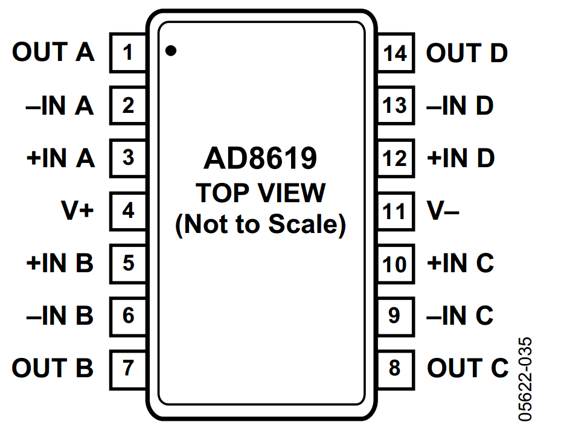

#### 24th Week Summarize

- 本周工作目标：

  - 由于上个星期对整个电路进行了设计，还差一个放大器部分，所以这周要完成放大器部分的设计并且提交到PCB厂商尽早画出想要的PCB板。
  - 开始准备生成模拟信号用于测试

- 在查询了有关AD8619的论文后（[Analog Devices : Healthcare ICs Solutions Bulletin, Volume 11, Issue 2 (psu.edu)](https://citeseerx.ist.psu.edu/document?repid=rep1&type=pdf&doi=67d00a7e2e6b532d7e95d5fb378d8db47219d2c3)）我发现它有提到一点十分重要：

  > - The AD8619 quad micropower op amp is a cost efficient option for EMG designs particularly when combined with the AD8235 in-amp and AD7798 ADC. The AD8619 is fully specified to operate from 1.8 V to 5.0 V single supply and combines 22 nV/√Hz noise and 1 pA max input bias current, draws 38 μA of supply current, and is available in 14-lead TSSOP and 14-lead SOIC packages

  - 以上说明了除了使用仪表放大器（AD8619），我们还需要前置放大器，因为仪表放大器的放大倍数普遍不高，而诸如EMG信号却仅仅只有uV级别，所以需要AD8235作为差分输入放大器。

- 至于是否需要AD7798作为ADC，电路中使用的GD32F103C8T6芯片已经自带了ADC功能，该芯片自带的ADC特性如下图所示：

- 

- AD7798数据：[AD7798/AD7799 (Rev. B) (analog.com)](https://www.analog.com/media/en/technical-documentation/data-sheets/ad7798_7799.pdf)

- 根据以上数据，得到如下表格：

  - | 比较项     | GD32F103C8T6 | AD7798         | 总结       |
    | ---------- | ------------ | -------------- | ---------- |
    | 分辨率     | 12bit        | 16/24 bit      | 均符合条件 |
    | 采样速率   | 0.04MSPS     | 4.17-470Hz     | GD32更优   |
    | 输入范围   | 0-3.6V       | 2.7V-5.25V     | 均符合条件 |
    | 噪声和失真 | 未提及       | 均方根噪声40nV |            |
    | 电源电压   | 2.6-3.6V供电 | 2.7-5.25V      | 均符合条件 |

    

  - 因此在比较之后，我们还是选择采用GD32自带的ADC。

- AD8235仪表放大器[AD8235 (Rev. A) (analog.com)](https://www.analog.com/media/en/technical-documentation/data-sheets/AD8235.pdf)

  - 查看了datasheet之后发现，AD8235是一个非常适合放大EMG信号的仪表放大器，因为他适用于医疗仪器领域。

    > - FEATURES
    >   	Low power
    >   		40 μA maximum supply current
    >   		6 nA shutdown current
    >   	Low input currents
    >   		50 pA input bias current
    >   		25 pA input offset current
    >   	High Common Mode Rejection Ratio (CMRR)
    >   		110 dB CMRR , G = 100
    >   	Space saving
    >   		WLCSP package
    >   	Zero input crossover distortion
    >   	Versatile
    >   		Rail-to-rail input and output
    >   		Shutdown
    >   		Gain set with single resistor (G = 5 to 200)
    >   	AD8236: μSOIC package version of AD8235
    >   APPLICATIONS
    >   	Medical instrumentation
    >   	Low-side current sense
    >   	Portable electronics

- 

- AD8619运算放大器

  - 

