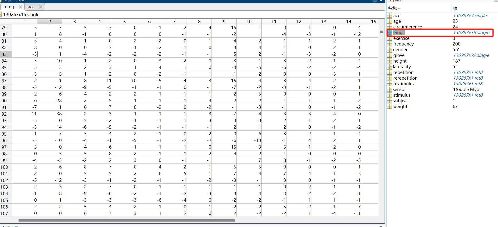
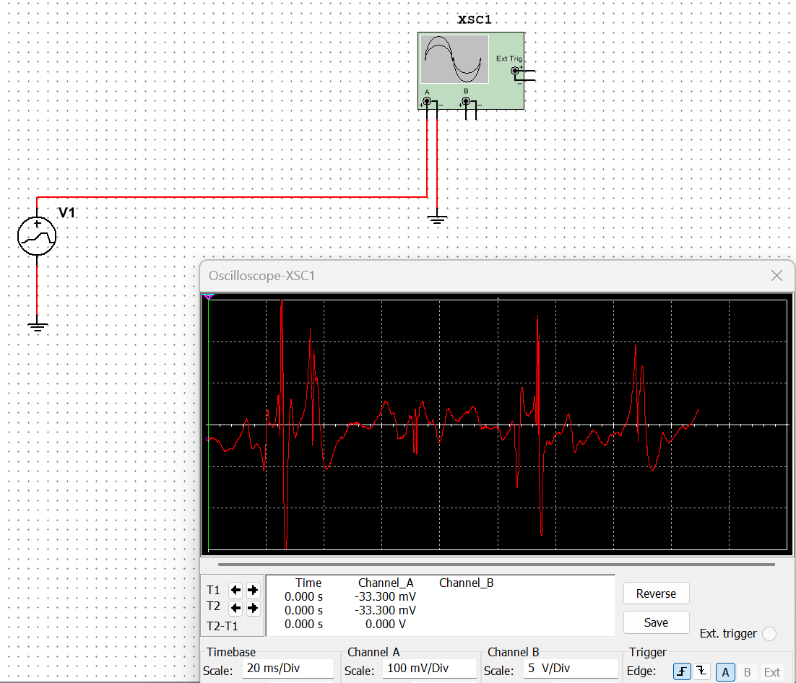
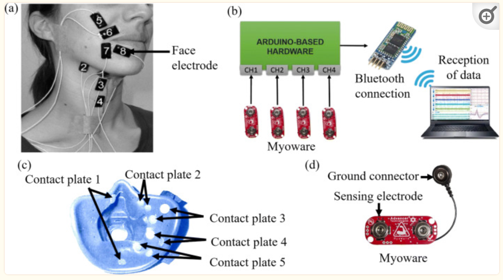

#### 25th Week Summarize

- 本周工作目标：

  - 上周我完成了PCB设计图的基本绘制，这周我打算首先完成数据集在Multisim的导入，然后将PCB设计图的电路再Multisim上面模拟实现。
  
- 在所下载的数据集中，有多个变量，其中的Emg变量才是sEMG的信号值，但是它是经过了处理的，其采样速率为200Hz。
  
- 
  
- 由于sEMG的数据有被处理，并且不适合Multisim的输入格式（时间 电压），所以放弃了这个数据集，重新找到了一个新的数据集：Examples of Electromyograms，并且通过PWL Voltage组件成功实现了在Multisim的模拟输入信号。

  - 链接地址：[肌电图示例 v1.0.0 --- Examples of Electromyograms v1.0.0 (physionet.org)](https://physionet.org/content/emgdb/1.0.0/)

  

- 在研究如何实现放大电路时，我发现了一个有关EMG的文献综述：[肌电信号采集与处理综述——PMC --- Review on electromyography signal acquisition and processing - PMC (nih.gov)](https://www.ncbi.nlm.nih.gov/pmc/articles/PMC7755956/)

  - 通过阅读这篇论文，我知道了
  - 

