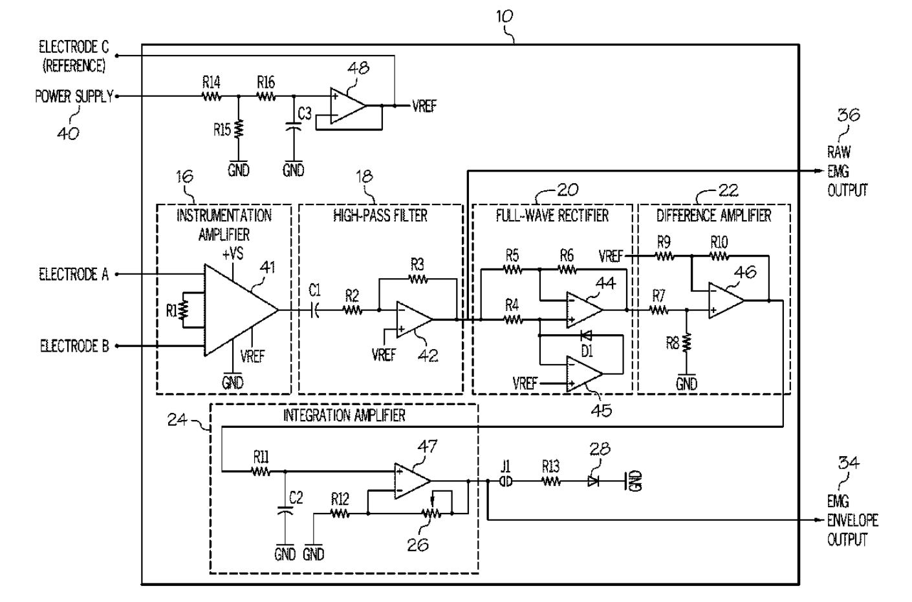

#### 25th Week Summarize

- 本周工作目标：

  - 上周我完成了PCB设计图的基本绘制，这周我打算首先完成数据集在Multisim的导入，然后将PCB设计图的电路再Multisim上面模拟实现。
  
- 在所下载的数据集中，有多个变量，其中的Emg变量才是sEMG的信号值，但是它是经过了处理的，其采样速率为200Hz。
  
- 
  
- 由于sEMG的数据有被处理，并且不适合Multisim的输入格式（时间 电压），所以放弃了这个数据集，重新找到了一个新的数据集：Examples of Electromyograms，并且通过PWL Voltage组件成功实现了在Multisim的模拟输入信号。

  - 链接地址：[肌电图示例 v1.0.0 --- Examples of Electromyograms v1.0.0 (physionet.org)](https://physionet.org/content/emgdb/1.0.0/)

  

- 在研究如何实现放大电路时，我发现了一个有关EMG的文献综述：[肌电信号采集与处理综述——PMC --- Review on electromyography signal acquisition and processing - PMC (nih.gov)](https://www.ncbi.nlm.nih.gov/pmc/articles/PMC7755956/)

  - 通过阅读这篇论文，我知道了要设计出来低成本EMG传感器，我们除了需要设计放大电路，还需要设计滤波器和整流器，但是我们的计划是通过原始信号传输给电脑然后使用Matlab进行处理，那么主要任务可能就是如何使用matlab对信号进行滤波，与设计PCB电路的任务并列。
  
    > - For portable EMG systems, MyoWare is the best sensor available in the market. For accurate results, MyoWare sensors are preferred over low-cost sensors. Filters and rectifiers need to be added before amplification if MyoWare is not used.
  
- 根据MyoWare1.0的电路图，我们想要得到Raw EMG output，只需要实现instrumentation amplifier再加上一个ADC就可以测量并转发了，如果连接树莓派甚至不需要PCB设计。

  - 

- 按照我的PCB电路设计，我计划用4通道的AD8619运放来驱动4个AD8235单通道低功耗仪器放大器，但是后来发现matlab也可以实现像AD8619的缓冲器的功能，所以只需要AD8235来实现放大即可，但是AD8235是单通道的仪表放大器，所以考虑重新选择适合的多通道仪表放大器。

  - AD8232：[AD8232 数据表和产品信息 |模拟器件公司 --- AD8232 Datasheet and Product Info | Analog Devices](https://www.analog.com/en/products/ad8232.html)，通过学习我知道，AD8232与AD8235相比，虽然它们都是生物电放大器芯片，AD8232功耗更低，增益更高，并且拥有双端输出，我觉得可以选择AD8232，因为未来可能可以把这个设备与节能的便携式电池供电设备结合，使EMG测量更加便捷。

- 在上周与导师聊天后得知，不需要额外进行PCB设计，那么我需要做的就是深入了解仪表放大器和ADC相关设备，通过学习[Microsoft Word - EDCh 2 other linear circuits.doc (analog.com)](https://www.analog.com/media/en/training-seminars/design-handbooks/Basic-Linear-Design/Chapter2.pdf)，我知道了仪表放大器需要能够放大微伏级别的信号，并且抑制输入端的共模信号电压，这就要求仪表放大器拥有非常高的共模抑制，但是除此之外在开发的过程中肯定有别的噪音，最常见的原因就是50 Hz/60 Hz 交流电源相关的噪声（包括谐波）。

- 有关树莓派的问题，我一直觉得可能为了实现便携性，我倾向于用树莓派当作一台类似PC的设备来处理型号并且显示在屏幕上，因为树莓派可以安装linux系统，并且在linux系统上运行matlab来分析数据。然后我会使用stm32为基础的单片机开发板来测量原始信号并通过wifi模块发送给树莓派，这是我的想法。

- 下周计划：

  - 把AD8232与AD8235进行更加详细的比对，并且选出比较适合的ADC设备然后着手进行采购。
  - 确定好采集数据所用的数据接口类型，并且学习SPI协议。
  - 确定好是树莓派直接连ADC和仪表放大器测量EMG还是树莓派通过wifi接收STM32发送的信号。

