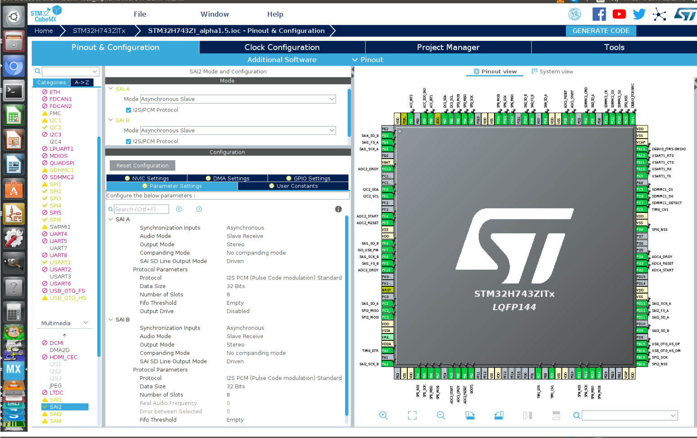
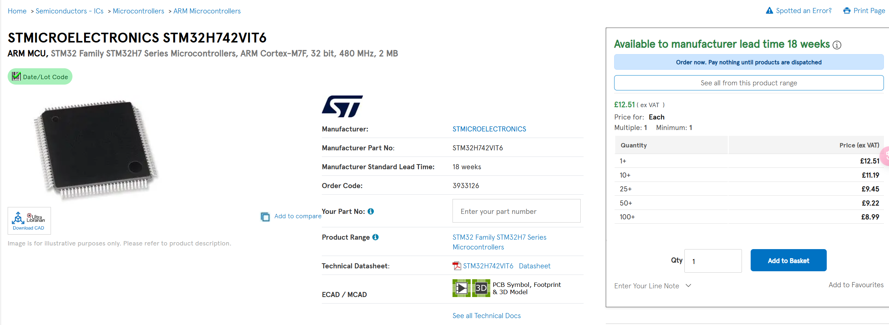

#### 27th Week Summarize

- 上周总结：

  - 上周完成了ADC的评估和选型，这周根据老师提示，我们对[neuroidss/FreeEEG32-beta: as FreeEEG32 plus alpha1.5 test passed, FreeEEG32 project changed to beta version (github.com)](https://github.com/neuroidss/FreeEEG32-beta?tab=readme-ov-file)相关项目进行彻底的了解。

- 在该项目中，我们了解到了其MCU为STM32H7432ITX，如下图所示：

  

- 上网查询有关信息，发现其价格大概在12磅左右，价格合理。

  

- 通过了解datasheet发现，STM32H742VIT6配备了高性能的ARM Cortex-M7内核，主频高达480 MHz。这使其能够快速处理和分析EMG信号的数据，提供实时的反馈和处理能力。

- 此外，该微控制器支持FreeRTOS等实时操作系统，可以进行多任务处理，有助于实现复杂的EMG信号处理算法和其他功能模块的并行处理，并且STM32H742VIT6依然具有较好的低功耗特性，这使得我们的设备后期可以实现便携式长时间运行的效果。

- 但是，由于我们已经选择了AD7771作为ADC采集工具，而AD8232作为仪表放大器，那么我们对于主MCU中关于ADC性能应该没什么要求，而我之前也买过一片 STM32WB5MMG芯片，虽然其用M.2接口连接，并且数据时钟频率只有100MHz远没有STM32H742VIT6 480MHz高，但我认为已经足够了，并且STM32WB5MMG还自带蓝牙功能。

- 然而，STM32H742VIT6没有蓝牙或者WiFi功能，如果选择该MCU的话我们后期可能需要通过UART协议让WiFi模块和该MCU连接，当然在此之前我也已经购买了蓝牙模块[410-359 Digilent, Inc. | Development Boards, Kits, Programmers | DigiKey](https://www.digikey.co.uk/en/products/detail/digilent-inc/410-359/8605090)和WiFi扩展板[SparkFun Qwiic WiFi Shield - DA16200 - WRL-18567 - SparkFun Electronics](https://www.sparkfun.com/products/18567)。

- 最后，根据项目中有关3D viewer的图片（如下图）与之前的分析，我们大致可以整理出我们需要的部件。

  

- 我们需要1个AD7771作为32路ADC测量，因为AD8232是单通道仪表放大器，所以需要8个AD8232作为不同ADC通道的仪表放大器选项，当然也可以4个AD7771加32个AD8232.
- 总而言之，我们现在有关MCU有两个选择，一个是STM32WB5MMG + M.2接口PCB板 + AD7771+AD8232，另一个选择是STM32H742VIT6 + 蓝牙模块/WIFI扩展板 + AD7771 + AD8232
- 此外，通过了解该github项目，我还知道了一个网站[欢迎来到 BrainFlow 的文档！ - BrainFlow 文档 --- Welcome to BrainFlow’s documentation! — BrainFlow documentation](https://brainflow.readthedocs.io/en/stable/)，通过该网站我们可以利用里面的有关生物传感器的脑电图、肌电图、心电图和其他类型的API来快速配置STM32或者树莓派测量EMG。
- 下周目标：
  - 由于最近期末考试繁多，最近这两周进展缓慢，从下周开始我会逐渐可以抽出时间去完成我的个人项目。
  - 下周目标主要是确定MCU的选型，并且根据现有购买物资来尽可能地做一些实质性的工作，比如说基于Arduino利用Myoware2.0首先先连接蓝牙模块实现其与树莓派的数据通信。