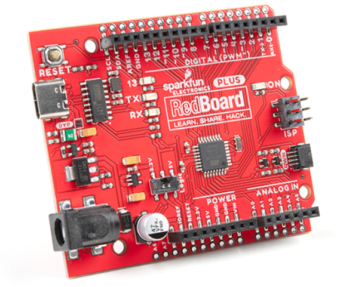
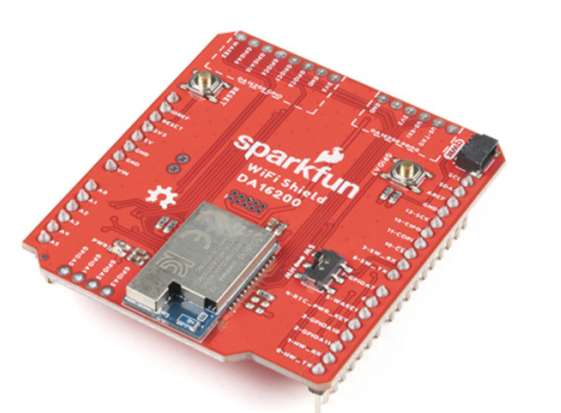
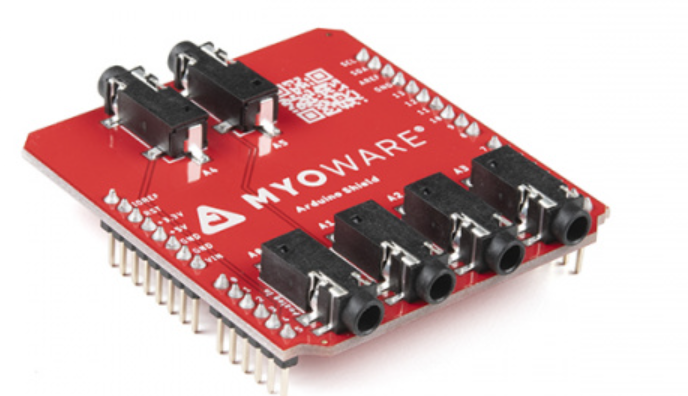
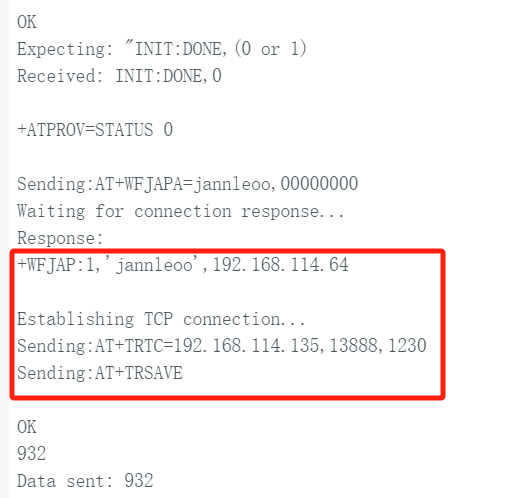
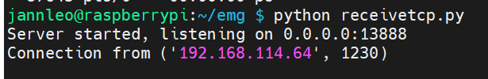
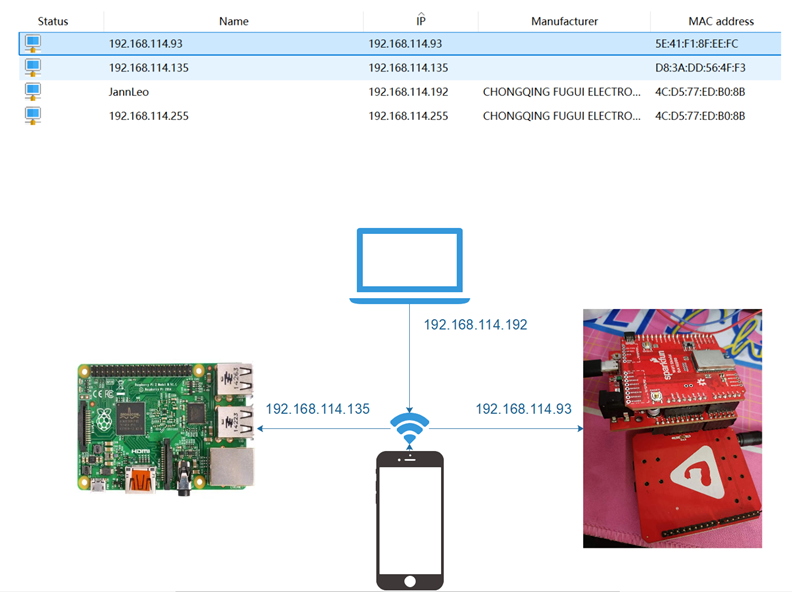

#### 27th Week Summarize

- 上周总结：

  - 上周对[neuroidss/FreeEEG32-beta: as FreeEEG32 plus alpha1.5 test passed, FreeEEG32 project changed to beta version (github.com)](https://github.com/neuroidss/FreeEEG32-beta?tab=readme-ov-file)相关项目进行彻底的了解后，我们准备首先利用Myoware2.0模拟实现我们开发板的功能。

- 我们的板子SparkFun RedBoard Plus虽然可以通过MyoWare 2.0 Arduino Shield实现两个板子的直接连接，但是由于RedBoard Plus没有WiFi或者是蓝牙功能，所以后续购买了一块ULP WiFi DA16200 R3扩展版并且将SparkFun RedBoard Plus两侧的扩展孔焊接了起来，用于连接MyoWare 2.0 Arduino Shield。

  

  

  

- 接着我们根据DA16200 Command User Manual在arduino软件上通过AT命令实现了配网与连接，在此过程中成功与树莓派进行了TCP连接。

  

  

- 主要连接拓扑图如下：

  

- 下周目标：

  - 由于最近期末考试繁多，最近这两周进展缓慢，从下周开始我会逐渐可以抽出时间去完成我的个人项目。
  - 下周目标主要是确定MCU的选型，并且根据现有购买物资来尽可能地做一些实质性的工作，比如说基于Arduino利用Myoware2.0首先先连接蓝牙模块实现其与树莓派的数据通信。